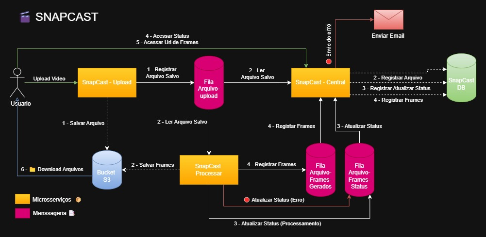
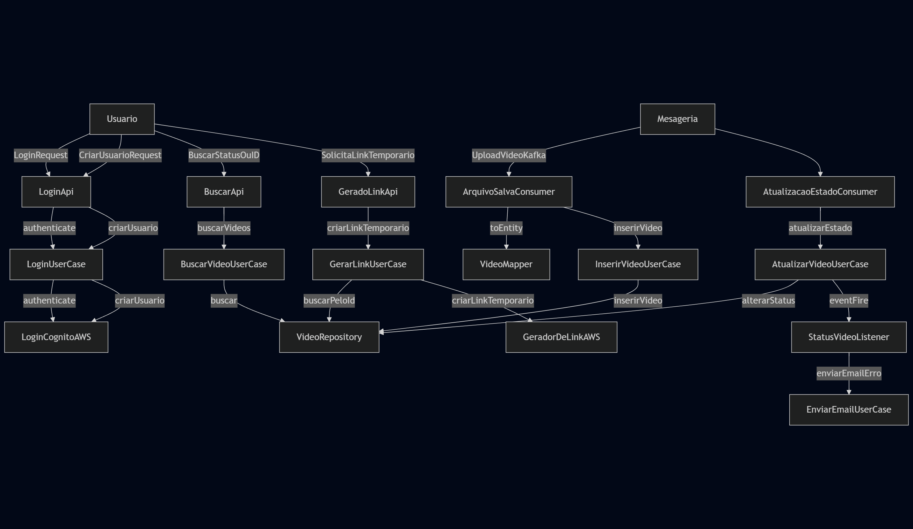

# 📽️ SnapCast Central


Este projeto é o backend central do SnapCast, responsável por orquestrar o processamento de vídeos, autenticação de usuários via AWS Cognito, geração de links temporários para download e integração com serviços de mensageira (Kafka).


## 💻 Como rodar em modo desenvolvimento

```shell script
./mvnw quarkus:dev
```

Acesse a Dev UI em: http://localhost:8080/q/dev/ 🚀

**Build e execução**
```shell script
./mvnw package
java -jar target/quarkus-app/quarkus-run.jar
```

### ⚙️ Variáveis de Ambiente

Crie um .env com as seguintes informações: 🛠️
```
AWS_REGION=
CLIENT_ID=
BUCKET=
USER_POOL_ID=
KAFKA_URL=
DB_KIND=
POSTGRES_USER=
POSTGRES_PASSWORD=
POSTGRES_URL=
EMAIL=
HOST_EMAIL=
SENHA_EMAIL=
```

### 🔗  Endpoints principais


| URL | Description |
| ----------- | ----------- |
|/login| 🔑  Autenticação e criação de usuário
|/buscar| 🔎 Busca de vídeos por status ou ID
|/link/{id}| ⏳ Geração de link temporário para download

### 🧪 Testes
Execute:
```shell script
./mvnw test
```

## Diagramas de Arquitetura

### C4


### Fluxo



